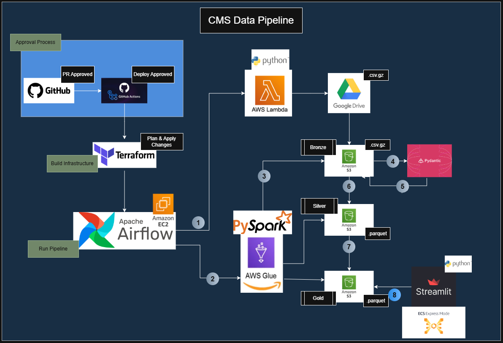

# CMS Project Explained

## The Goal
The Centers for Medicare and Medicaid Services(CMS) releases a quarterly report named the Skilled Nursing Facility Quality Reporting Program (SNF QRP), that holds data that could be used as key indicators of high or low quality of care for Skilled Nursing Facility across the United States. The goal of this project is to determine if staffing levels reported in tha Payroll Based Journal Nurse Staffing Quarterly Reports impacted the quality of care received by residents of nursing care facilities.

## Breaking the Problem Down
Before I could start building the pipeline I had to understand what key factors existed in the report that could be used to determine actual patient outcomes and limit my analysis to those key performance indicators to determine the overall impact of staffing levels on those outcomes. It was determined that one of the tables held several quality measures including : 

1. Hospital readmission rates (How often are patients coming from the thospital just to be readmitted to the hospital?)
2. Number of pressure ulcers  (How many patients are reporting pressure ulcers usually due to lack of movement?)
3. Number of falls in a facility
4  Number of infections in a facility
5. Discharge To Community Rats (Positive outcome that shows number of short term care patients able to be reintroduced back into their community?) 
 
 

If each of these were analyzed we could start to determine if the level of staffing actually did show an effect on patient outcomes, as they all required high level of attention through staff intervention to prevent the negative, or promote the positive outcomes mentioned.

### Data Challenges
Each of these outcomes are kept in a Quality_Reporting_Program_Provider_Data table that listed all measures recorded in each facility in independent rows across all providers. This meant that a single facility would have several entries (or a one-to-many relationship) for each quality measure recorded. 

After further inspection each quality measure encompassed measurement periods that were outside of the current reporting period. This meant the 2024 Q2 report measured outcomes from over the 8 quarters prior to that report which could not be analyzed using the staffing journal for that quarter alone. Each target measure also had different lengths of measurement periods meaning we needed to aggregate each measure independently and compare it to prior periods payroll journal data to get an accurate picture of the true staffing levels present during each independent period. I also needed a baseline of how these outcomes compare at state and national levels, and we also wanted to confirm staffing levels of each measure for both weekdays and weekends. 

This required a couple of things
1. Retrieve the payroll journal data for all recorded periods in the 2024 Q2 Quality_Reporting_Program_Provider_Data (Only 2024Q2 payroll journal data was provided initially)
2. Aggregate those tables in a way that allows us to match each measurement period up with the staffing levels for that time period.

After gathering the data, it was determined that because this was a quarterly report creating an on demand service that would not need to run often but be able to handle a lot of data and transform operations, while being able to recover from a failure without losing data was essential. With this in mind I decided to create a AWS pipeline that could handle the initial file ingestion and transform operations with elastic computing that could be monitored, managed using Airflow on an EC2 instance then decommissioned in between quarters after creating or updating the data lake that would remain readily available through S3 storage. 

Because of the long running and resource intensive nature of uploading large datasets I decided that using python throughout would keep the pipeline capability flexible enough to handle each operation necessary from start to end. I also wanted to make sure that data validation was in place before the transform operations were run using Pydantic. By creating and using config values to paint the shape of our expectations for each ingested table we can ensure that things like data drift or inappropriately typed data columns were identified before starting a glue operation that is doomed to fail. 

After the model validation the transform operations are handled using PySpark to allow for distributed computing, in an efficient way using the auto scaling features of AWS Glue. I also wanted to be able to keep track of each step of this process by having a Data Workflow Orchestration tool in place that would allow for a graphical interface that could show what portion of the jobs were complete, what steps had failed, and a way to restart the particular steps from a particular point of failure. Airflow fit perfectly into this situation as we could create a DAG that could reach out to independent AWS services and send results back to the central orchestration tool to report completion updates or issues with processing. 

The file migrations from Google Drive to AWS S3 uses a python script run through Lambda. This way we only need to pay for the compute that is actually used, while utilizing on-demand elastic services to handle simple transfers. I changed the initial files to .gzip files from .csv to not only reduced the overall size of each of the large files, but also reduced overall time and cost it took to migrate using Lambda and S3 storage by storing zipped files that required no additional processing as PySpark is capable of handling .gz files natively.

AWS Glue was selected for transforming the data from raw to silver and from silver to gold layers because it is easily able to handle on-demand computing operations of large datasets using PySpark. Because of the one-to-many relationships that exist in the Provider Quality Data and potential partitioning involved, Spark is the leader in handling this type of transform on demand. 

To visualize the change, it was decided to use Streamlit to allow for easily display staffing data across Lower Upper-Lower, Upper-Mid and Upper quartile staffing levels, while also being able to adjust the minimum number of cases or differences in confidence intervals to allow the user to adjust the level of accuracy included in each metrics display.  

## Approval
Each time a job is pushed to the repo not only is there a requirement for an approval for the pull request but also a deploy gate that allows for additional approval before any changes to the hosting environments are made, using IAM permissions that were mostly created and can be maintained using HCL statements through Terraform. After approved changes are planned and applied, and all repositories needed to run the Lambda Functions, Glue Jobs, the Airflow Server or the Streamlit container are automatically applied and updated on deploy using GitHub Actions. 

## Hosting
This pipeline requires hosting for the Airflow and Streamlit Applications. All host servers are created using Terraform. This was implemented without including actual passwords or sensitive tokens or secrets in any file stored in the repository. Why host Airflow on EC2 instead of just using the pre-packaged managed Airflow Service **COST**. A Managed Airflow service costs a minimum of $0.49 to $0.99 per hour without computing cost and cannot use spot instances for core tasks. Because we just need this quarterly, we can create a spot instance as needed we can reduce cost by only creating it when needed then decommission it as soon as we verified the job completed. 

### Streamlit (Visualization) Hosting
The Streamlit app is hosted on ECS Express server and is updated on the "Build, tag, and push Streamlit image" step in the apply.yml workflow. The Image that is used to on the Streamlit server is created, stored and maintained using the AWS Elastic Container Registry (ECS). The docker image produced by composing the prod.dockerfile at the root of the project then adding the necessary tags to the ECS registry. That dockerfile holds the instructions responsible copying all files needed for the Streamlit app as well as the command to start the service. The endpoint for accessing this service is produced as an output of the Terraform Apply step after the registry is updated with the most recent image. A SHA hash generated by GitHub is associated with each approved commit and included in the registry's reference name so every time the files required to run the Streamlit application changes, the ECS registry automatically updates the files after recognizing any changes in the Terraform Plan while ECS Express is set up to re-deploy the Streamlit app each time the image in the registry is updated to ensure the app is always up to date. 

After changes are successfully applied, an updated endpoint on where to access the Streamlit App is provided as an output at the end of the terraform apply step. The stored Registry is set up to implement a lifecycle policy so that only the last three images are kept available in the registry, preventing costly bloat of retaining old outdated images. The ECS Express Gateway service is how we tell ECS Express what type of server we want, the amount of compute and memory, where to source the docker image from, and a basic scaling strategy set to automatically scale when 70% CPU is in use.  This is completely maintained and managed from the code base which needs to be approved before a merge as well as deploy.

### Airflow (Data Workflow Orchestration)
The Airflow Service is hosted on an EC2 Server is also created using Terraform HCL statements in 'aws-ec2-airflow.tf', executed during the Terraform Apply step. Instead of keeping an image available from the Elastic Container Registry and updating a pre-existing image, the pipeline instead generates the packaged code dependencies and updates the existing instance, if running, over an SSM upload or applies the HCL statements to create the infrastructure before adding the bundled dependencies then deploying if not. Terraform only changes the EC2 instance if the 'airflow_user_data.sh.tp' file changes. If so, the existing instance is destroyed and a new instance is created. There is no dockerfile created and the instance is set to be stopped after all processes have been terminated. In a real production environment, we would create an instance feed that could link to an external database to persist all records outside of this instance (like a RDS or an EFS) to maintain DAG history but was not included in this pipeline exercise.

## Streamlit Visualizations
I first aggregated the staffing measures in a way that could allow a single staffing table to be used across multiple quality metrics and joined using the quarter that links to the actual staffing period reflected in the payroll journal for each actual measurement period. Where applicable I have created a filter that only shows metrics where there is a minimum number of cases, or a specific difference in upper and lower confidence intervals to allow a user to dictate the level of accuracy each measure presents. More numbers of cases and smaller differences in upper and lower confidence intervals mean a higher level of accuracy, while lower number of cases and a larger difference in upper and lower confidence intervals would indicate lower accuracy. I created the slider for users to determine for themselves how the metrics are presented at different levels of accuracy.

Each graph is loaded then cached per graph and per environment to prevent constant fetching of data unnecessarily.

